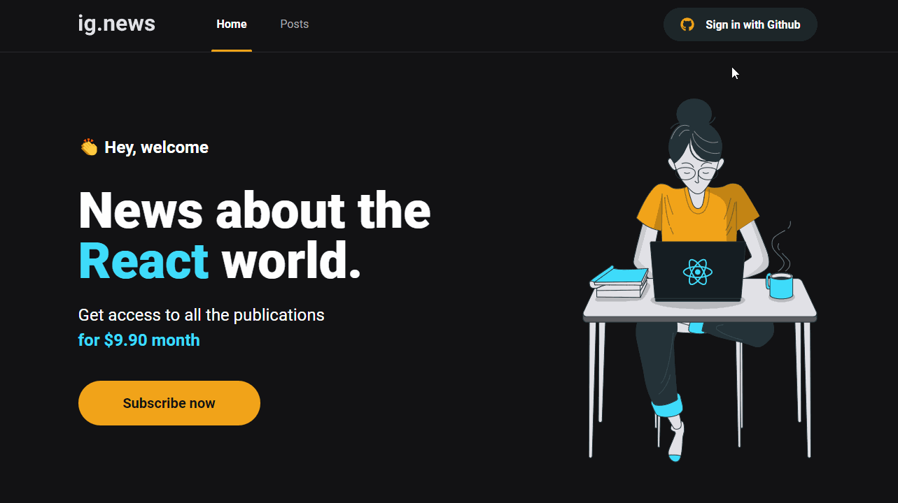

# ignews

Projeto do curso Ignite - Trilha React da [Rocketseat](https://rocketseat.com.br/). Aplicação de conteúdos em texto que só podem ser acessados por meio de assinatura. Aplicação construída com NextJS, salvando informações no FaunaDB, conteúdos gerados por CMS e pagamentos processados pelo Stripe.

## ✨ Preview

## 🛠 Builded with

##  About me

- 👤 Bacharel em jornalismo se aventurando pelo mundo da programação, estudando stacks relacionadas ao front-end, focado em ReactJS

- 🔭 Me encontre:  
